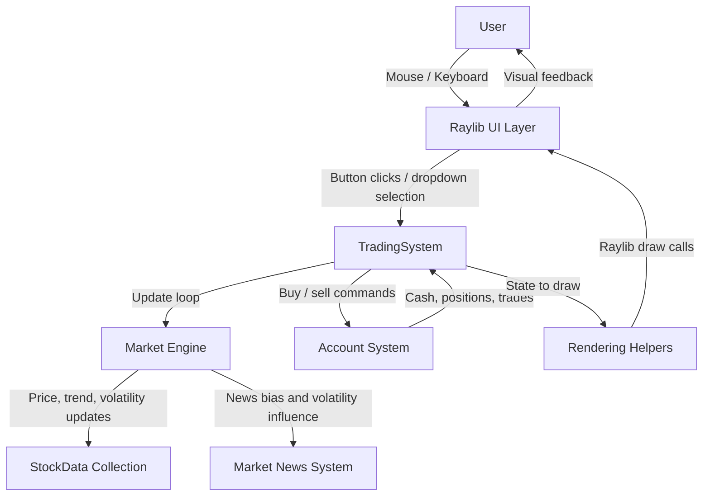
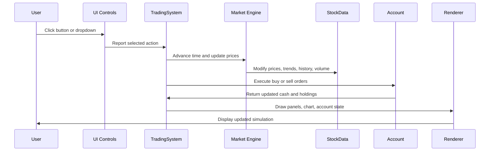
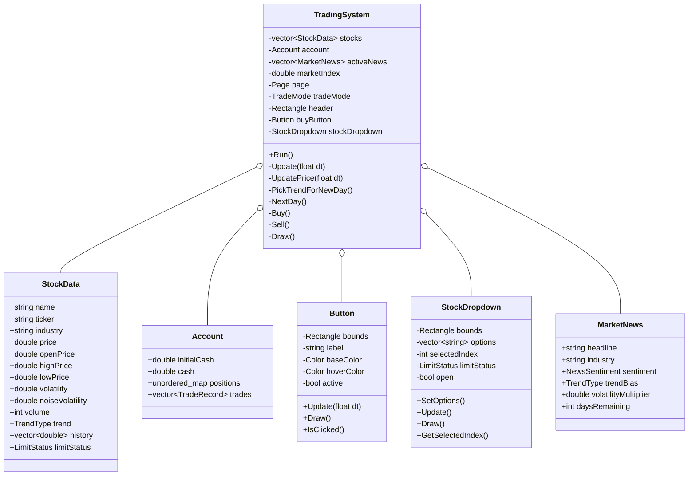
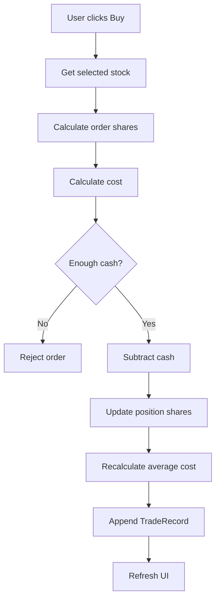
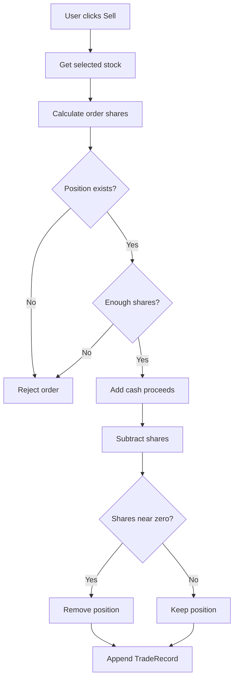

# Taiwan Stock Trading Simulator Documentation

## 1. Project Overview

### Project Goal

The Taiwan Stock Trading Simulator is a real-time stock market simulation built in C++ with Raylib. The project models a simplified but interactive trading environment where users can observe simulated stock prices, react to market news, place buy and sell orders, and track portfolio performance.

The main goal is to demonstrate object-oriented programming through a complete graphical application. Instead of building isolated classes only for a console program, the project integrates simulation logic, account management, UI rendering, user interaction, and financial rules into one working system.

### Why the Project Was Built

This project was built as an object-oriented programming final project to show how C++ classes and structs can model a real-world system. A stock trading simulator is a strong OOP project because it naturally contains interacting objects:

- Stocks have prices, trends, volume, and history.
- Accounts have cash, positions, and trade records.
- UI controls receive input and display state.
- A trading engine updates market prices over time.
- News events influence market behavior.

The simulator also introduces domain-specific rules from the Taiwan stock market, including red/green price conventions, 10 percent limit-up and limit-down rules, board-lot trading, and odd-lot trading.

### Main Features

- Multiple simulated stocks across five industries.
- Real-time price updates.
- Bullish, neutral, and bearish trend states.
- Market news system with sentiment, industry, trend bias, and volatility.
- Industry performance panel.
- Market index initialized at 1000 and updated from real stock returns.
- Taiwan-style price colors: red for up, green for down.
- 10 percent limit-up and limit-down rules.
- Limit lock behavior after reaching limit-up or limit-down.
- Board-lot trading where 1 lot equals 1000 shares.
- Odd-lot trading using integer individual shares.
- Buy and sell order execution.
- Portfolio and account tracking.
- Trade history page.
- Account page.
- Responsive Raylib UI with a dark TradingView/Bloomberg-style design.
- Resizable window with F11 fullscreen support.

### Technologies Used

| Technology | Purpose |
|---|---|
| C++17 | Main programming language |
| Raylib 5.5 | Windowing, graphics, input, font rendering |
| CMake | Build configuration |
| Object-Oriented Programming | Class-based architecture and modular design |
| Standard Library | Vectors, strings, maps, random distributions, algorithms |

### Application Entry Point

The program begins in `src/main.cpp`:

```cpp
int main() {
    TradingSystem app;
    app.Run();
    return 0;
}
```

The `TradingSystem` object owns the main simulation loop and coordinates all other systems.

---

## 2. System Architecture

### High-Level Architecture

The application is organized around one central controller class, `TradingSystem`. This class owns the market state, account state, UI components, simulation timing, and drawing logic.



### Component Responsibilities

| Component | Responsibility |
|---|---|
| `TradingSystem` | Main application controller, update loop, market logic, layout, rendering |
| `StockData` | Stores stock market state such as price, volume, trend, high/low, history, limit status |
| `Account` | Stores cash, positions, and trade history |
| `MarketNews` | Represents active market news and its effect on probability and volatility |
| `Button` | Reusable clickable UI control |
| `StockDropdown` | Allows users to select the active stock |
| `GUI` | Theme colors, fonts, text formatting, rendering helpers |

### Data Flow

The main data flow follows this pattern:



### Runtime Loop

`TradingSystem::Run()` repeatedly:

1. Reads frame time.
2. Calls `Update(dt)`.
3. Begins Raylib drawing.
4. Clears the background.
5. Calls `Draw()`.
6. Ends drawing.

This creates a real-time simulation where market data changes while the user interacts with the interface.

---

## 3. Class Design

### UML-Style Class Overview



### TradingSystem

#### Purpose

`TradingSystem` is the central application controller. It owns the simulation state, handles the main loop, updates market prices, processes user input, draws every screen, and coordinates trading operations.

#### Main Responsibilities

- Initialize the Raylib window and fonts.
- Create the initial stock list.
- Generate and rotate market news.
- Update stock prices in real time.
- Apply Taiwan limit-up and limit-down rules.
- Update the market index.
- Process buy and sell orders.
- Manage account, history, and news pages.
- Recalculate responsive layout rectangles.
- Draw the TradingView-style UI.

#### Important Member Variables

| Variable | Purpose |
|---|---|
| `stocks` | Collection of all simulated stocks |
| `selectedStock` | Index of the currently selected stock |
| `activeNews` | Current active market news |
| `newsHistory` | Historical list of generated news |
| `account` | User account data |
| `marketIndex` | Real simulated index starting at 1000 |
| `marketOpenIndex` | Index value at start of current day |
| `tradeMode` | Board lot or odd-lot mode |
| `page` | Current UI page |
| `header`, `marketRow`, `leftPanel`, etc. | Responsive layout rectangles |
| `stockDropdown`, `buyButton`, `sellButton` | UI controls |
| `rng` | Random number generator for market simulation |

#### Important Methods

| Method | Purpose |
|---|---|
| `Run()` | Main application loop |
| `Update(float dt)` | Dispatches update logic based on active page |
| `UpdateMain(float dt)` | Updates main trading screen input and market simulation |
| `AdvanceTime(float dt)` | Moves simulated time forward |
| `UpdatePrice(float dt)` | Updates every stock price and history |
| `PickTrendForNewDay()` | Chooses daily trend states using probability weights |
| `NextDay()` | Advances to a new session and resets intraday state |
| `UpdateMarketIndex()` | Updates the market index using average industry returns |
| `GenerateNews()` | Creates a new active market news event |
| `Buy()` | Executes a buy order |
| `Sell()` | Executes a sell order |
| `DrawMain()` | Draws the main trading interface |
| `DrawChart()` | Draws the price history chart |

### StockData

#### Purpose

`StockData` stores all market-related data for one stock. It is a data model used by the simulation engine and rendering system.

#### Important Fields

| Field | Meaning |
|---|---|
| `name` | Full company name |
| `ticker` | Short stock symbol |
| `industry` | Industry category |
| `price` | Current stock price |
| `previousPrice` | Previous update price, used for return and momentum |
| `openPrice` | Opening price for the current trading day |
| `highPrice` | Highest intraday price |
| `lowPrice` | Lowest intraday price |
| `changePercent` | Intraday percentage change from open |
| `volatility` | Displayed intraday high-low range percentage |
| `noiseVolatility` | Internal random-noise strength for simulation |
| `momentum` | Recent tick-to-tick percentage movement |
| `volume` | Simulated trading volume |
| `trend` | Bullish, neutral, or bearish daily trend |
| `history` | Intraday price history for chart rendering |
| `limitStatus` | None, LimitUp, or LimitDown |

### Account

#### Purpose

`Account` stores the user's simulated trading account.

#### Important Fields

| Field | Meaning |
|---|---|
| `initialCash` | Starting account cash |
| `cash` | Current available cash |
| `positions` | Map from ticker to current holding |
| `trades` | List of completed buy and sell records |

#### Related Structs

`Position` stores:

- `shares`
- `averageCost`

`TradeRecord` stores:

- Whether the trade was a buy or sell.
- Ticker.
- Execution price.
- Quantity.
- Time string.

### Button

#### Purpose

`Button` is a reusable UI component for clickable controls.

#### Responsibilities

- Store a rectangle, label, and colors.
- Detect hover using Raylib mouse collision.
- Detect click on mouse release.
- Animate hover color interpolation.
- Draw rounded button background, border, and centered label.
- Support active/inactive state for mode buttons.

### StockDropdown

#### Purpose

`StockDropdown` manages stock selection.

#### Responsibilities

- Store available stock option labels.
- Track the selected stock index.
- Toggle between closed and open states.
- Detect option selection.
- Draw dropdown options.
- Color the dropdown red or green if the selected stock is at limit-up or limit-down.

The dropdown intentionally does not display extra text such as "Limit Up" or "Limit Down". The limit state is communicated through color, while detailed limit information is displayed in the Stock Info panel.

### GUI

#### Purpose

`GUI` provides shared drawing utilities and theme definitions.

#### Theme System

The `Theme` struct centralizes UI colors:

- `BG`, `TOP`, `PANEL`, `PANEL_2`, `PANEL_3`
- `TEXT`, `MUTED`, `DIM`
- `UP_RED`, `DOWN_GREEN`
- `LIMIT_UP_DARK`, `LIMIT_DOWN_DARK`
- `ACCENT_BLUE`
- `GRID`

This supports a consistent dark TradingView/Bloomberg terminal style.

#### Font System

The project loads `SFPRODISPLAYREGULAR.OTF` from the resources folder. It maintains:

- `gUIFont` for general UI text.
- `gNumberFont` for numeric values.

If the font cannot be loaded, the system falls back to Raylib's default font.

#### Rendering Helpers

| Function | Purpose |
|---|---|
| `GetUIScale()` | Scales text and spacing based on window width |
| `DrawUI()` | Draws general text |
| `DrawNumber()` | Draws numeric text |
| `TextWidth()` | Measures text for alignment |
| `LerpColor()` | Interpolates colors |
| `FormatMoney()` | Formats currency |
| `FormatPercent()` | Formats percentages |
| `FormatChangePercent()` | Formats signed percentages |
| `TrendColor()` | Returns color for trend state |

---

## 4. Price Simulation Engine

### Price Update Formula

At each simulation price tick, each unlocked stock is updated using:

```text
Price(t + 1) = Price(t)
             + TrendDrift
             + RandomNoise
             + NewsAdjustment
```

Where:

```text
TrendDrift    = Price(t) * TrendDriftPercent
RandomNoise   = Price(t) * RandomNoisePercent
NewsAdjustment = Price(t) * NewsAdjustmentPercent
```

The current implementation intentionally keeps all terms small so that most days stay within ordinary intraday ranges and limit-up/limit-down events remain rare.

### Trend Drift

Each stock has a daily trend state:

- `Bullish`
- `Neutral`
- `Bearish`

Trend drift represents the directional pressure of that day's market environment.

Current ranges:

| Trend | Per-update drift percent |
|---|---|
| Bullish | +0.0012% to +0.0035% |
| Neutral | -0.0010% to +0.0010% |
| Bearish | -0.0035% to -0.0012% |

In decimal form, these values are:

```text
Bullish: 0.000012 to 0.000035
Neutral: -0.00001 to 0.00001
Bearish: -0.000035 to -0.000012
```

### Random Noise

Random noise creates natural variation so prices do not move in a straight line. It simulates uncertainty, order flow, liquidity, and short-term market activity.

The simulation stores internal noise strength in:

```cpp
stock.noiseVolatility
```

Then computes:

```text
RandomNoisePercent = random(-noiseVolatility, +noiseVolatility)
```

Normal noise is selected in a small range. Stronger news days can increase the noise range, but only slightly.

### Displayed Volatility

The user-facing volatility shown in the Stock Info panel is not the internal random-noise value. It is calculated as intraday range:

```text
Volatility (%) = ((HighPrice - LowPrice) / OpenPrice) * 100
```

Example:

```text
Open = 91.47
High = 92.62
Low = 91.46

Volatility = ((92.62 - 91.46) / 91.47) * 100
           = 1.27%
```

This separation prevents simulation coefficients from being displayed directly to the user.

### News Effect

News does not directly force prices to rise or fall. Instead, it primarily affects:

1. Trend probability.
2. Volatility.
3. A very small direct drift.

The direct news adjustment is intentionally tiny:

```text
NewsAdjustmentPercent = trendBiasDirection * industryInfluence * random(0.000008, 0.00002)
```

Where:

- `trendBiasDirection = +1` for bullish news.
- `trendBiasDirection = -1` for bearish news.
- `trendBiasDirection = 0` for neutral news.
- `industryInfluence = 1.0` for affected industry.
- `industryInfluence = 0.2` for other industries.

This means news influences market conditions rather than guaranteeing a price direction.

---

## 5. Market News System

### News Structure

Market news is represented by `MarketNews`:

```cpp
struct MarketNews {
    std::string headline;
    std::string industry;
    NewsSentiment sentiment;
    TrendType trendBias;
    double volatilityMultiplier;
    int daysRemaining;
};
```

### News Generation

`TradingSystem::GenerateNews()` selects a news event from a predefined list. Each event has:

- Headline.
- Industry.
- Sentiment.
- Trend bias.
- Volatility multiplier.
- Duration in days.

### News Categories

| Category | Meaning |
|---|---|
| Positive news | Raises bullish probability and slightly raises volatility |
| Negative news | Raises bearish probability and slightly raises volatility |
| Neutral news | Keeps direction neutral but may still affect volatility |
| Industry-specific news | Strongly affects matching stocks and weakly affects others |

### Example News Events

| Headline | Industry | Sentiment | Trend Bias |
|---|---|---|---|
| AI demand surges | Technology | Positive | Bullish |
| Bank regulations tighten | Finance | Negative | Bearish |
| Healthcare breakthrough | Healthcare | Positive | Bullish |
| Oil prices collapse | Energy | Negative | Bearish |
| Global shipping boom | Transportation | Positive | Bullish |
| Loan defaults rise | Finance | Negative | Bearish |

The user requested examples such as:

- AI Demand Surge.
- Bank Crisis.
- Healthcare Breakthrough.
- Oil Supply Shock.

These are represented by the current template system through technology, finance, healthcare, and energy news events.

### How News Influences Trend Probability

Default trend weights:

```text
Bullish = 30
Neutral = 40
Bearish = 30
```

For bullish news:

```text
Bullish += 12 * influence
Neutral -= 3 * influence
Bearish -= 9 * influence
```

For bearish news:

```text
Bullish -= 9 * influence
Neutral -= 3 * influence
Bearish += 12 * influence
```

Industry influence:

```text
Same industry: 1.0
Other industries: 0.2
```

### Why News Does Not Force Prices

Real markets often behave counterintuitively. A stock can rise on bad news or fall on good news because investors may already expect the news, broader market conditions may dominate, or random trading pressure may overwhelm the event.

The simulator models this by making news probabilistic rather than deterministic.

---

## 6. Industry Performance System

### Industries

Each stock belongs to one of five industries:

1. Technology
2. Finance
3. Healthcare
4. Energy
5. Transportation

Current initial stocks:

| Stock | Ticker | Industry |
|---|---|---|
| Aurora Tech | AUR | Technology |
| Nova Bank | NVB | Finance |
| MedCore Health | MCH | Healthcare |
| Green Energy | GEE | Energy |
| Ocean Shipping | OSC | Transportation |

### Industry Performance Calculation

The Industry Performance panel calculates the average intraday percentage change of all stocks in each industry.

Formula:

```text
IndustryPerformance = sum(stock.changePercent for stocks in industry) / stockCount
```

Because the current project has one stock per industry, each industry score currently equals that stock's intraday performance. The design supports multiple stocks per industry in the future.

### Example

If Technology contains three stocks:

```text
AUR = +1.20%
CHP = +0.80%
NXT = -0.20%

Technology Performance = (1.20 + 0.80 - 0.20) / 3
                       = +0.60%
```

### Relationship to News

News affects industries in two ways:

1. Same-industry stocks receive full trend probability and volatility influence.
2. Other industries receive only 20 percent influence.

Example:

```text
Headline: Oil prices collapse
Industry: Energy
Sentiment: Negative

Energy stocks: strong bearish probability shift
Other industries: small market-wide influence
```

---

## 7. Taiwan Stock Market Features

### Limit Up and Limit Down

The simulator implements Taiwan-style daily price limits:

```text
Limit Up = OpenPrice * 1.10
Limit Down = OpenPrice * 0.90
```

A stock cannot trade above the limit-up price or below the limit-down price.

### Limit Status

The limit status enum is:

```cpp
enum class LimitStatus {
    None,
    LimitUp,
    LimitDown
};
```

When a stock reaches limit-up:

```text
price = limitUpPrice
limitStatus = LimitUp
```

When a stock reaches limit-down:

```text
price = limitDownPrice
limitStatus = LimitDown
```

### Limit Lock Behavior

While a stock is locked at limit-up or limit-down:

- Price remains exactly at the limit boundary.
- Trend drift is not applied.
- Random noise is not applied.
- News adjustment is not applied.
- Volume continues to increase.
- The chart records identical prices, creating a flat line.

There is a small chance each update tick for the limit lock to reopen temporarily. This models the real-world behavior where a limit stock can occasionally unlock and trade again.

### Taiwan Color Convention

The simulator follows Taiwan stock market color convention:

| Meaning | Color |
|---|---|
| Price up | Red |
| Price down | Green |
| Limit up | Red |
| Limit down | Green |
| Neutral | White or gray |

This differs from the common United States convention, where green often indicates rising prices.

### Board-Lot Trading

Whole mode represents board-lot trading:

```text
1 lot = 1000 shares
```

If the user enters `2` in board-lot mode, the order size is:

```text
2 lots * 1000 shares = 2000 shares
```

### Odd-Lot Trading

Odd-lot mode represents individual shares:

```text
1 unit = 1 share
```

Only integer share quantities are accepted. Decimal inputs such as `0.5` or `5.5` are rejected.

---

## 8. Trading System

### Buy Process

When the user clicks Buy:

1. The system reads the selected stock.
2. It calculates order quantity based on trade mode.
3. It calculates estimated cost.
4. It checks whether the account has enough cash.
5. It subtracts cash.
6. It updates or creates the position.
7. It recalculates average cost.
8. It records the trade.



### Buy Formula

```text
cost = stock.price * orderShares
```

Average cost after buying:

```text
newAverageCost =
    (oldAverageCost * oldShares + stock.price * newShares)
    / totalShares
```

### Sell Process

When the user clicks Sell:

1. The system reads the selected stock.
2. It calculates order quantity.
3. It checks whether the account owns enough shares.
4. It adds sale proceeds to cash.
5. It subtracts shares from the position.
6. It removes the position if shares become zero.
7. It records the trade.



### Account Update Logic

The account has:

```text
cash
positions
trade records
```

Total asset value is:

```text
TotalAsset = cash + sum(position.shares * currentStockPrice)
```

Position value:

```text
PositionValue = sharesHeld * currentStockPrice
```

Unrealized profit or loss:

```text
UnrealizedPnL = sharesHeld * (currentStockPrice - averageCost)
```

---

## 9. User Interface

### Overall UI Style

The interface uses a dark professional trading style inspired by TradingView, Bloomberg Terminal, and modern brokerage platforms. Panels use dark backgrounds, thin borders, muted labels, and strong numerical color coding.

The window is resizable, with a minimum size of 1200 x 800. The default size is 1600 x 1000. F11 toggles fullscreen.

### Header

The header displays:

- Application title.
- Current simulation day.
- Current simulation time.
- Market open status.
- Trader/avatar button.

Screenshot placeholder:

```text
[Screenshot: Header with Day, Time, Market Open, and Trader avatar]
```

### Market Information Row

The market row displays:

- Current selected stock price.
- Intraday change.
- High.
- Low.
- Open.
- Volume.
- Market Index.
- Index Change.
- Top Gainer (Market).
- Top Loser (Market).

Screenshot placeholder:

```text
[Screenshot: Market information row with stock metrics and market index]
```

### Stock Information Panel

The Stock Info panel displays:

- Stock selector.
- Ticker.
- Industry.
- Trend.
- Current price.
- Change.
- Open.
- High.
- Low.
- Limit up price.
- Limit down price.
- Current limit status.
- Volatility.
- Momentum.

Screenshot placeholder:

```text
[Screenshot: Stock Info panel with limit prices and volatility]
```

### Price Chart

The chart displays intraday price history for the selected stock. It updates in real time and resets at the start of each new trading day.

Screenshot placeholder:

```text
[Screenshot: Intraday line chart with red and green price segments]
```

### Trading Panel

The Trading Panel displays:

- Cash.
- Total assets.
- Current holdings.
- Average cost.
- Position value.
- Unrealized profit/loss.
- Board-lot and odd-lot mode buttons.
- Quantity input.
- Estimated cost.
- Buy, Sell, and Next Day buttons.
- Warning messages for insufficient cash or shares.

Screenshot placeholder:

```text
[Screenshot: Trading Panel with order controls]
```

### Market News Panel

The Market News panel displays:

- Headline.
- Industry.
- Sentiment.
- Trend Bias.
- Volatility.
- Days Remaining.
- Explanation box: news changes probability and volatility, not guaranteed returns.

Screenshot placeholder:

```text
[Screenshot: Market News two-column panel]
```

### Industry Performance Panel

The Industry Performance panel displays each industry's average intraday performance:

- Technology
- Finance
- Healthcare
- Energy
- Transportation

Values are right-aligned and color coded using Taiwan convention.

Screenshot placeholder:

```text
[Screenshot: Industry Performance panel]
```

### Account Page

The Account page displays:

- Account cash.
- Total portfolio value.
- Total assets.
- Current positions.
- Holding quantities.
- Average costs.
- Position values.

Screenshot placeholder:

```text
[Screenshot: Account page with portfolio positions]
```

### Trade History Page

The Trade History page displays:

- Buy and sell records.
- Ticker.
- Quantity.
- Price.
- Time.

Screenshot placeholder:

```text
[Screenshot: Trade History page]
```

---

## 10. Chart Rendering

### Price History Storage

Each `StockData` object stores a vector:

```cpp
std::vector<double> history;
```

This vector contains intraday price points. During each price update, the current price is pushed into history. If the vector grows beyond the maximum chart length, the oldest point is removed.

At the start of each new trading day, history is cleared and reseeded with flat opening-price points. This prevents the new day from visually continuing the previous day's line.

### Dynamic Range Calculation

The chart calculates:

```text
minPrice = minimum(history)
maxPrice = maximum(history)
```

Then it adds padding:

```text
padding = (maxPrice - minPrice) * 0.12
```

This prevents the line from touching the top or bottom of the chart area.

### Coordinate Mapping

Each price is mapped to a y-coordinate:

```text
y = gridBottom - ((price - minPrice) / (maxPrice - minPrice)) * gridHeight
```

The x-coordinate is based on the price point index in the history vector.

### Color Logic

Each line segment compares the current history point to the previous point:

```text
if current > previous: red
if current < previous: green
if current == previous: muted gray unless at limit
```

If the price is at limit-up, the segment is red. If the price is at limit-down, the segment is green.

### Why Rising Prices Are Red

The project follows Taiwan market convention:

- Rising prices are red.
- Falling prices are green.

This is the opposite of many US trading platforms, but it matches the Taiwan stock market visual standard.

---

## 11. Object-Oriented Programming Concepts

### Encapsulation

The project encapsulates related data and behavior inside focused classes:

- `TradingSystem` owns simulation control and high-level application state.
- `Button` owns button geometry, hover state, and drawing.
- `StockDropdown` owns dropdown options, selection state, and rendering.
- `StockData` groups all state for one stock.
- `Account` groups cash, positions, and trades.

This reduces global state and makes responsibilities clearer.

### Abstraction

The project abstracts repeated operations into reusable helpers:

- `DrawUI()` hides Raylib font drawing details.
- `DrawNumber()` separates numeric rendering from general text.
- `FormatMoney()` and `FormatPercent()` hide string formatting.
- `Button::IsClicked()` hides Raylib mouse input checks.
- `GetOrderShares()` hides board-lot versus odd-lot conversion.

### Composition

`TradingSystem` is composed of several smaller objects:

```text
TradingSystem
    contains Account
    contains vector<StockData>
    contains StockDropdown
    contains Button objects
    contains MarketNews objects
```

This is composition because the application controller owns and coordinates these components.

### Modular Design

The code is divided into headers and implementation files:

| File | Purpose |
|---|---|
| `TradingSystem.h/.cpp` | Main simulation and UI controller |
| `StockData.h` | Stock data model |
| `Account.h/.cpp` | Account and trade data |
| `Button.h/.cpp` | Reusable UI button |
| `StockDropdown.h/.cpp` | Stock selection dropdown |
| `GUI.h/.cpp` | Fonts, theme, formatting, drawing helpers |
| `NewsEvent.h` | Market news data model |
| `main.cpp` | Program entry point |

### Demonstration of OOP Principles

The project demonstrates object-oriented programming by modeling real-world entities as program entities. Stocks, accounts, buttons, dropdowns, and news events each have a clear purpose and are used together to create a complete interactive system.

---

## 12. Challenges and Solutions

### Challenge: Price Simulation Tuning

Early versions of the simulator moved prices too aggressively. Stocks frequently hit limit-up or limit-down, which made the market feel unrealistic.

Solution:

- Reduced trend drift.
- Reduced random noise.
- Reduced direct news drift.
- Made news primarily affect probability and volatility.
- Added index damping so the market index moves less than individual stocks.

### Challenge: News Balancing

If news directly pushes prices too strongly, the simulator feels scripted. For example, negative energy news would always make energy stocks fall.

Solution:

- News changes trend probability.
- News changes volatility.
- News applies only a very small direct drift.
- Same-industry stocks receive full influence.
- Other industries receive 20 percent influence.

This creates realistic outcomes where bad news increases bearish probability but does not guarantee a price drop.

### Challenge: Limit-Up and Limit-Down Implementation

A simple price clamp created a sawtooth chart pattern where a stock touched limit-up, moved slightly down, and then touched limit-up again.

Solution:

- Added explicit `LimitStatus`.
- Locked prices exactly at limit-up or limit-down.
- Disabled drift, noise, and news while locked.
- Continued increasing volume while locked.
- Added a small chance for the stock to unlock and trade again.
- Reset limit status at the start of each new day.

### Challenge: Intraday Chart Reset

The chart originally carried the previous day's history into the next day.

Solution:

- `NextDay()` now clears stock history.
- The chart is reseeded with flat opening-price points.
- Each day starts as a fresh intraday session.

### Challenge: UI Layout Problems

As the interface grew, panels became crowded and text overlapped.

Solution:

- Increased default window size to 1600 x 1000.
- Added resizable window support.
- Added minimum window size.
- Added `UpdateLayout()` to calculate rectangles dynamically.
- Used UI scaling through `GetUIScale()`.
- Adjusted stock info, trading, news, and industry panels for readability.

### Challenge: Font Rendering Issues

Small font sizes were hard to read on larger windows.

Solution:

- Added UI scale based on screen width.
- Increased important font sizes.
- Separated numeric drawing through `DrawNumber()`.
- Loaded a custom SF Pro font with fallback to Raylib default.

### Challenge: Misleading Volatility Display

The UI originally displayed the internal random-noise coefficient as volatility, which appeared as `0.00%`.

Solution:

- Added separate `noiseVolatility` for simulation.
- Redefined displayed `volatility` as:

```text
((HighPrice - LowPrice) / OpenPrice) * 100
```

This gives users a meaningful intraday volatility number.

---

## 13. Future Improvements

Potential improvements include:

1. More Stocks
   - Add multiple stocks per industry.
   - Add different market capitalizations and weights.

2. Real Candlestick Charts
   - Store open, high, low, close per interval.
   - Render OHLC or candlestick charts instead of only line charts.

3. Portfolio Analytics
   - Daily return.
   - Realized profit and loss.
   - Risk exposure by industry.
   - Win/loss ratio.

4. Technical Indicators
   - Moving averages.
   - RSI.
   - MACD.
   - Bollinger Bands.

5. Market Depth
   - Simulated bid and ask prices.
   - Order book visualization.
   - Liquidity effects.

6. AI-Generated News
   - Generate dynamic headlines.
   - Vary news severity.
   - Add multi-day economic themes.

7. Database Integration
   - Persist accounts.
   - Save trade history.
   - Save market sessions.

8. Multiplayer Trading
   - Multiple players trading the same simulated market.
   - Leaderboards.
   - Shared news events.

9. Weighted Market Index
   - Weight stocks by market capitalization.
   - Support sector indexes.

10. More Taiwan Market Rules
    - Trading sessions.
    - Auction behavior.
    - Tick size rules.
    - Transaction fees and taxes.

---

## 14. Conclusion

The Taiwan Stock Trading Simulator is a complete interactive C++ and Raylib application that combines object-oriented programming, graphical UI design, real-time simulation, and financial market rules.

The project includes:

- A multi-stock simulation engine.
- Realistic trend, noise, and news-based market behavior.
- Taiwan-style limit-up and limit-down rules.
- Board-lot and odd-lot trading.
- Account and portfolio tracking.
- Trade history.
- Market news.
- Industry performance.
- A real market index.
- Responsive TradingView-style UI.

From an object-oriented programming perspective, the project demonstrates how classes and structs can represent real-world concepts and collaborate inside a larger system. `TradingSystem` coordinates the application, while `StockData`, `Account`, `Button`, `StockDropdown`, `MarketNews`, and GUI helpers each handle focused responsibilities.

The result is a practical final project that shows both software engineering structure and domain-specific simulation design. It demonstrates not only C++ syntax, but also architecture, data modeling, user interface design, and iterative problem solving.
